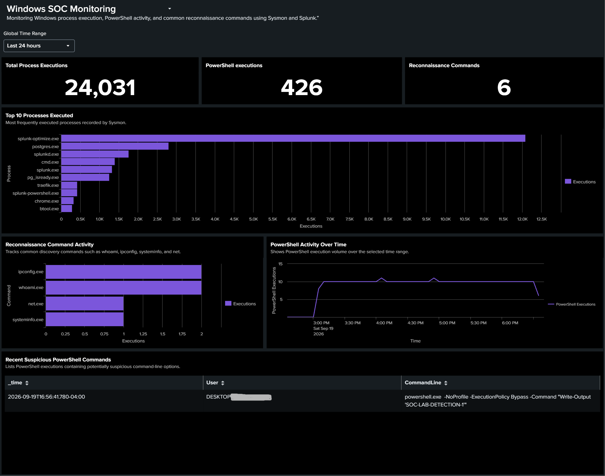

# Windows SOC Monitoring Project

I built this project to get more hands-on experience with Splunk, Sysmon, and Windows security monitoring.

The main goal was to collect Windows process activity, search through it in Splunk, and build some basic detections for activity that could be worth investigating in a SOC environment.

## Tools

- Splunk Enterprise
- Sysmon
- Windows Event Viewer
- Command Prompt
- PowerShell

## What I Did

I installed Sysmon on my Windows machine and configured Splunk to collect the Sysmon Operational logs.

From there, I created SPL searches to monitor things like:

- PowerShell activity
- Common reconnaissance commands such as `whoami`, `ipconfig`, `systeminfo`, and `net`
- Parent-child process relationships, such as `cmd.exe` launching PowerShell
- Process creation activity using Sysmon Event ID 1

I also created a scheduled alert for suspicious PowerShell command-line activity and built a dashboard to make the activity easier to monitor.

## PowerShell Detection

One of the detections looks for PowerShell commands that use arguments such as:

- `ExecutionPolicy Bypass`
- `NoProfile`
- `EncodedCommand`
- `-enc`
- `-nop`

These options are not always malicious, but they can be useful indicators to investigate when they appear unexpectedly.

## Dashboard

I built a Splunk dashboard to make the Windows activity easier to review in one place.

It includes:

- Total process executions
- PowerShell executions
- Reconnaissance command activity
- Top executed processes
- PowerShell activity over time
- Recent suspicious PowerShell commands



## Test Activity

To test the searches, I generated some activity on my own machine and then looked for it in Splunk.

Some of the commands I used were:

```text
whoami
ipconfig
systeminfo
net user
